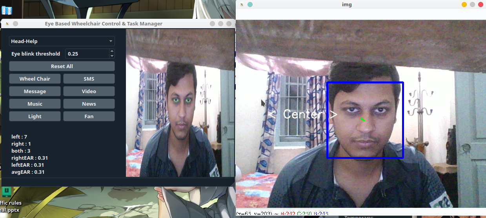

# Eye gaze detection
> Primary release (v1)

## Description
In this project, we designed and implemented a system that will use users’ eye gaze, eye blinks, head gestures or voice commands to control its functionality. The system has a task manager GUI which has functionality of wheelchair controlling, phone calling, SMS/email sending, e-book reading, web browsing, Google searching, light/fan operating, keyboard operating and so on. Peripheral devices of our system – electric wheelchair, Light, Fan etc. are hosted by a raspberry pi and communicate with the main system through a Wi-Fi network.

## Python Package Dependencies
1. opencv - Used to train eye gaze directions with haarcascade classfier.
2. dlib - Used to get the facial landmarks.
3. zeep - For sms.
4. speechrecognizer - For speech to text.
5. pyqt - For GUI
6. qdarkstyle - For dark theme
7. pyglet - Util
8. imutils - Util
9. scipy - Util

## Getting started
1. `git clone https://github.com/rahatzamancse/Eye-Gaze-Detection.git`
2. Install necessary dependencies to your python virtual environment.
3. Run `python3 main.py`

## Features
* Task manager control with eye blinks/head gestures/voice command
* Wheelchair control with eye gaze/head gestures/voice command 
* SMS/Email sending with eye/head controlled keyboard
* Audio/Video player control with eye blinks/head gestures/voice command
* E-book reader control with eye blinks/head gestures/voice command
* Web browser control with eye blinks/voice command
* Light/Fan operating with eye blinks/voice command
* Emergency alert sending with eye blinks/voice command

## Contributing
The main reason to publish something open source, is that anyone can just jump in and start contributing to my project.
So If you'd like to contribute, please fork the repository and use a feature branch. Pull requests are warmly welcome.

## Links and References
- Project homepage: https://github.com/rahatzamancse/Eye-Gaze-Detection
- Repository: https://github.com/rahatzamancse/Eye-Gaze-Detection.git
- In case of any help you may need from me, please contact rahatzamancse@gmail.com directly without any hesitation! I will be glad to help you.
- PyQt: https://riverbankcomputing.com/software/pyqt/intro
- Speech recognition: https://github.com/Uberi/speech_recognition#readme
- Zeep: https://python-zeep.readthedocs.io/en/master/
- dlib: http://dlib.net/python/index.html
- opencv: https://docs.opencv.org/2.4/index.html

## Author
Rahat Zaman
rahatzamancse@gmail.com
Student at Department of Computer Science and Engineering
Khulna University of Engineering & Technology, Khulna
Bangladesh

## Licensing
The code in this project is licensed under GNU GPLv3 license.
